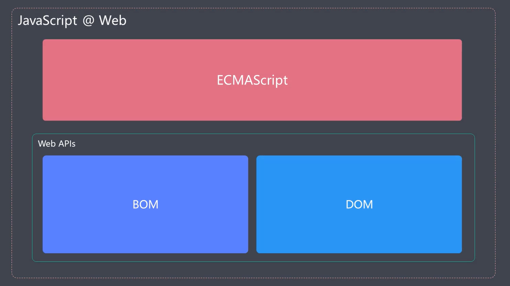
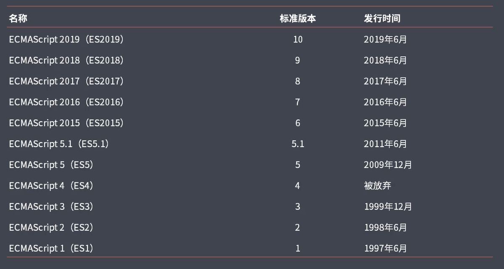
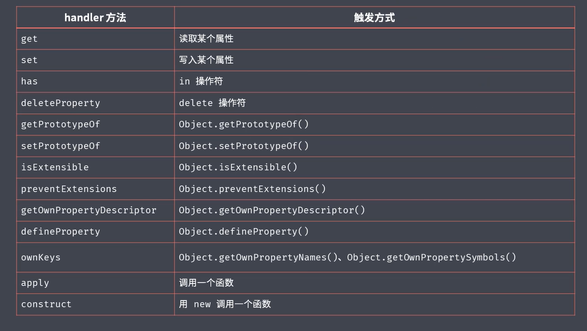
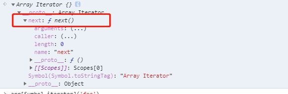
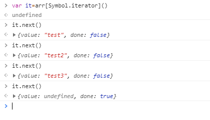

# ECMAScript
### （一）概述
1.ECMAScript和JavaScript什么关系
  通常，ECMAScript是作为一个新的规范，其提供基本的语法，实际JavaScript是比较全面的，它包括操作页面元素对象的DOM.BOM
  DOM是一套操作HTML标签的API（接口/方法/属性）
  BOM是一套操作浏览器的API（接口/方法/属性）
  
  然后基于Node.js 的话，就没有DOM和Bom. 而是node提供的APi
  
2.ECMAScript2015的新特性有什么？
   一般我们可能会把Es6暗指是ES2015以后的所有版本。其实也就是指新的语法，比如Es6中xxx
   

  整体的改动可以规划为四点：
  - 解决原来语法上的一些问题或者不足 
    eg：let const 块级作用域...
  - 对原语法的增强 
    eg：解构、展开的语法、模板字符串...
  - 全新的对象、方法、功能 
    eg：promise,proxy,object.assign()..
  - 全新的数据类型和结构 
    eg：set map....

  ES官网文档：http://www.ecma-international.org/ecma-262/6.0/
3.ECMAScript2016,2017 and more?
### （二）我们会使用比较多的新语法 OR 我们应该掌握的
1.作用域
  在ES6之前我们大部分的作用域都是
  - 全局作用域
  - 函数作用域
  - 块级作用域 【新增】
  
``` javascript
if(true){
    var a='xxx'
}
console.log(a) // xxx

if(true){
    let a='xxx'
}
console.log(a) // undefined
```
  而且Let 的声明不会变量提升
```javascript
console.log(a) // undefined, a 已经声明没赋值而已
var a='xxx' // let a='xxx' 就会报错
```
2.Const 

  顾名思义就是常量，不能修改，只能赋值方式去处理，但是如果是对象[数组]，那你要修改对象[数组]中的值那还是OK的。
  因为它的实际是变量的内存地址不能改；

3.数组的结构

``` javascript
  const a= [1,2,3]
  // 按以往的获取数组的内容，那就是根据角标去获取
  a[0] //1
  a[1] //2
  a[2] //3
  // 那通过解构
  const [x,y,z]=a;
  console.log(x,y,z) //1,2,3
  // 如果只要某一个的话，那就需要按格式来表示那个, 其实就像是数组下标取值，得对号入座。不然也是undefined
  const [,,n,jj]=a
  console.log(n,jj) //3 undefined,

  const [,, n, jj=2 ]=a //==》类似 a[4]=2


  const [...n] = a //... 只能是最后一个，
  const [m, ...x] = a //...获取剩余的返回新数组
  console.log(n, n === a, x)// false
```
4.对象的结构


``` javascript
  const a= {
      name:'xxx',
      age: 18
  }
  const {name}=a
  console.log(name)
  // 那万一我的name 已经有被申明了呢，不用怀疑，肯定报错。
  // 那就需要重命名解构的取值了
  const {name:asName}=a
```

5.模板字符串&标签函数

  `xxxx` ---拼接字符串，然后又可以在里面使用变量 `${xxx}`

  cosnt a= tagFuncName`xxxx` ==>tagFuncName(arg),arg 就是xxx 以变量来split 分割的数组

6.字符串对象的扩展方法
 - 'string'.includes()
 - 'string'.startsWith()
 - 'string'.endsWith()


7.函数参数默认值&剩余参数

``` javascript
  function test(a=true){ //但是这个要注意，必须是最后一个参数才能这样
    console.log(a)
  }
  function foo(...args){ //必须是最后一个参数才能这样
      console.log(args) //剩余的参数
  }
```

8.箭头函数
    略...

9.对象字面量的增强

``` javascript
  var test = {
    foo: '123',
    hh: function() {},
    hh2() {}
  }
```

10.Object.assign() && Object.is()

11.Obejct.defineProperty && Proxy

``` javascript
var person = {
  name: 'tom',
  hh2() {

  }
};

const perProxy = new Proxy(person, {
  get(target, props) {
      console.log('我监听到你了-取值', target, props); //
      return target[props]
  },
  set(target,props,value) {
      console.log('我监听到你了-设值', target, props, value); //
      // 自然set 无需return
      target[props]=value
  }
});

let a = perProxy.name;//触发监听，获得get的return。
console.log(a);//tom
perProxy.name = 'zwq'
console.log(perProxy.name);

/*
我监听到你了 { name: 'tom', hh2: [Function: hh2] } name
tom
我监听到你了-设值 { name: 'tom', hh2: [Function: hh2] } name zwq
*/
```

那他们之间的区别的话，proxy更全面，能监听到很多其他操作，而defineProperty相对来说就只有get set 
以及对数组的监听更方便，以往的监听就是重写数组的的操作方法，slice,push...[vue 中基本是这样的]
   


proxy 数组的话，在上面代码中涉及的props就会是数组下标

12.Reflect 新的内置对象
 
 不能通过new 处理，eg:Math 对象，其主要是封装了一系列对对对象的底层操作
 主要还是proxy处理对象的方法

 就像是我们监听对象的get set...默认情况下我们主动去添加get set 
 默认会自动使用reflect对象的方法

``` javascript
 const test= new Proxy(obj,{
   get(target,property){
     return Reflect.get(target,property)
   }
 })
```
另外Reflec 提供了很多方法可以获取对象的属性等操作

``` javascript
 Reflect.has(obj,'xxx') //判断存在
 Reflect.deleteProperty(obj,'xxx') 
 Reflect.ownKeys(person) //== Object.keys(person)
```

13.Promise 

14.Class 

  老的方式。自然是function 的prototype.xxx的方式去处理。这种方式来定义一个类型
  
``` javascript
  const { log } = console;
  class person {
    constructor(name) {
        this.name = name; 
    }
    say() {
        log(`${this.name}`)
    }
  }

  new person('tom').say()
```
  静态方法 static

``` javascript
    //在上面的基础上添加的静态方法
    static create(tom) {
        return new person(tom)
    }
```
15.继承 extends

``` javascriptset
class son extends person {
    constructor(name, age) {
        super(name); //调用父类的constructor
        this.age = age
    }
    hellow() {
        super.say(); //调用父类的say
        log(this.age)
    }
}

```
16.新的数据结构 Set && Map

``` javascript
const s= new Set();// has(),delete(),clear()...etc
s.add(1).add(2);//链式调用。。但是会自动去重，所以可以用来数组去重
```
Map 结构，但是它的key 是可以用对象作为key[其实是任意类型的数据都可以]；而普通的obj 是会被自动tostring(),转成字符串[object object]
同样有 has(),delete(),clear()...etc

new Map([
    ['test', 111],
    ['aaaa', 222]
]).foreach()--->也可以用来遍历map对象的key value

17.symbol 类型

   体会：例如我们在开发中很容易的变量冲突问题，const abc={}, 我定义了abc['test']='xx' ,然后另一个不知道也定义了abc['test']='2222';
   那这样就把我的定义覆盖了，通常我们会定义规范，abc['a_test'],abc['b_test'],但是只要有人不守规范，那就died..
   
   所以有了const s = Symbol();
   symbol 是独一无二的类型；
   
``` javascript
Symbol()===Symbol() //false
Symbol('des') //string 参数作为该symbol数据的描述内容，用于区分多个symbol,但是实际上描述可以重复，
Symbol('private')===Symbol('private') //false, 但是实际不是同一个
Symbol.for('test') === Symbol.for('test')  // true, 这样就是同一个了，其实也是内部处理也是利用维护一个全局变量做的

```

``` javascript
const s = Symbol();
const person = {
  [s]: 'test',// symbol 作为key 必须[]包裹是吧
  hello() {
      log(this[s]);//取值也是一样。
  }
};
person.hello();
// 另外，symbol() 作为key的,Object.kes(), JSON.stringify(),都拿不到的。。。只有getOwenPropertySymbols()能拿到
```
    
18.for of 循环，一个能够遍历所有数据结构的

  可以break终止遍历。。太好了。

``` javascript
const set = new Set(['abc', 'def']);
for (const item of set) {
    log(item);//abc def
}


const mp = new Map();
mp.set('abc', 123)
mp.set('def', 345)
for (const item of mp) {
    log(item);//[ 'abc', 123 ] [ 'def', 345 ]
}
for (const [key,value] of mp) {
    log(key,value);//abc 123 ；def 345
}

// 但是Object 不能直接用。。必须实现Iterator
```

19.实现Iterator
  
  可以手动去调用那些能for in 的Symbol.iterrator看看
   
   
   

 同样的set map 都是利用这个next.  所以说for of 可以遍历所有数据，都是要实现这个iterator的next();

``` javascript
const obj = {
    [Symbol.iterator]: function() { //Iterable---[Symbol.iterator] func
        return { //Iterator--next func
            next() {
                return { //IteratorRst ---value done
                    value: 'text',
                    done: true
                }
            }
        }
    }
}
  ```

  其核心就是对外开发一个统一遍历内部数据的外部接口。这样其他模块只要调用就好了。

20.Generator 生成器，其实就是按上面的Iterator规范处理,配合yield

``` javascript
  function* test() {
    log(1)
    yield 1;//类似return 会中断后面的操作。但是实际上是返回一个 next() 再next() 一下就会往下走。
    log(2);
    yield 2;
    log(3);
  }

  log(test())// 返回一个 Object [Generator] {} ，对象包含迭代器的next 方法
  //只有调用对象的next方法才能真正执行函数体，然后遇到yield 就会终止，等待下一次next()
  const ger = test();
  log(ger.next());//1  { value: 1, done: false } 
  log(ger.next())//1  { value: 1, done: false }； 2  { value: 2, done: false }
  log(ger.next())//1  { value: 1, done: false }； 2  { value: 2, done: false } 3 { value: undefined, done: true }---因为没有了yield, 它就认为是到底了，然后done就为true.
```
  
  配合之前的迭代器。那就可以优化了
``` javascript
const obj = {
  [Symbol.iterator]: function * () { //Iterable---[Symbol.iterator] func
      // return { //Iterator--next func
      //     next() {
      //         return { //IteratorRst ---value done
      //             value: 'text',
      //             done: true
      //         }
      //     }
      // }
      yield 'xxx'
  }
}
```

21.ESModule(待补充)

22.ES2016,ES2017 新加方法
 - Array.includes() 
 - Object.values() ，对比keys()
 - Object.entries()  //[[key,value],[key,value]...]