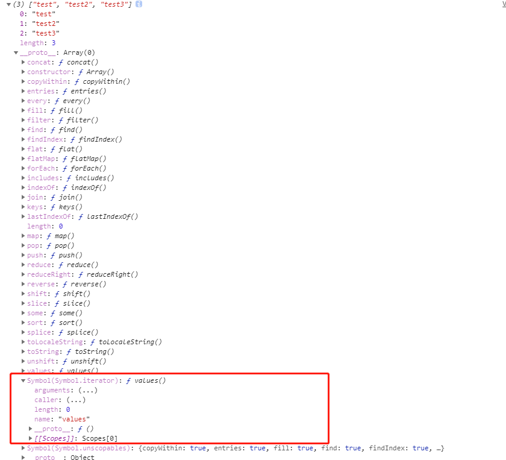
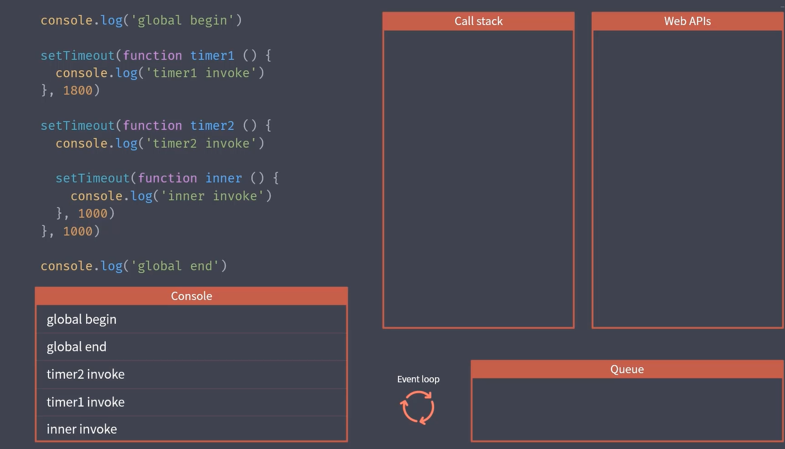

# JavaScript·异步编程的理解

### （一）概述
1、单线程？为什么是，假设多线程操作DOM，那就会混乱；
  JS执行环境中负责执行的代码的线程只有一个。
  就像只有一个检票口，只能排对一个一个来。-耗时

  为了解决这个问题：
  - 同步模式
  - 异步模式
### （二）主要内容

1.同步模式和异步模式的差异

 同步：
   

 函数的声明不会调用，所以会继续往下，其实就是队列的形式，先进后出。然后执行就进栈

2.事件循环和消息队列
   

EventLoop 主要就是循环监听（）调用栈和队列里面有没有程序要执行，然后将消息队列中的第一位的程序放入调用栈执行

消息队列可以看作是代办事项，而调用栈自然是主办事项，

3.异步编程的几种方式

4.Promise异步方案、宏任务/微任务队列

4.Generator异步方案、anysc/await
